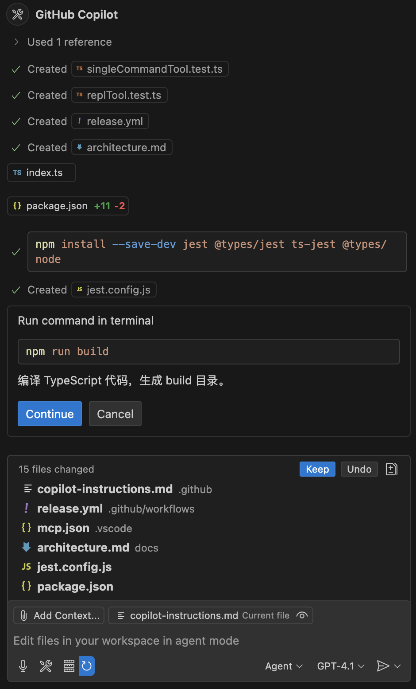
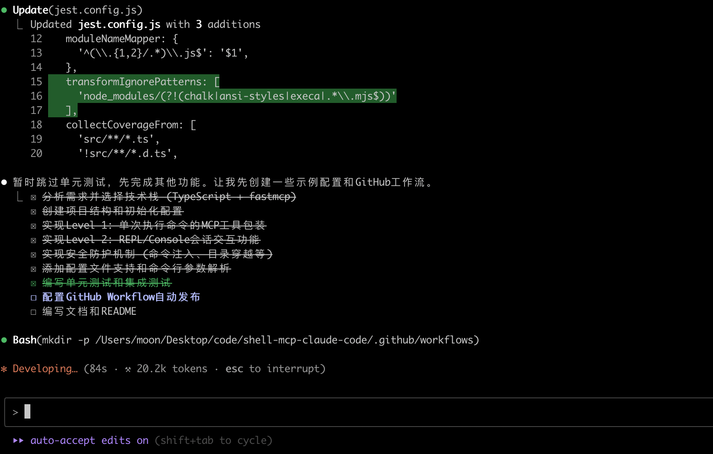

# 背景

> 人类少年们在奋战高考，AI 王国的小朋友们也迎来了自己的高考（bushi

AI 编程产品越来越多（以至于文章标题都快写不下了），自媒体笔下的程序员已经失业不止三千遍。

然而各大评分 Benchmark 不断被刷，大家已经麻木了。真正展示效果的是应用案例。然而大多数测评案例要么是单文件的算法题，要么是无具体业务逻辑的前端页面，要么是被做过无数遍的小项目（贪吃蛇或者俄罗斯方块），这些都与真实场景下的工程化开发有一定距离。

最近脑洞想写一个 MCP Server。这是一个真实的需求，难度适中，逻辑不复杂，但也有一些小坑。加上对模块化、测试、工程化的要求，正好拿来给 AI 们练练手。

# 需求

完整的开发需求 Prompt 见[这里](https://github.com/lmy375/ai-code-survey/blob/main/prompt.txt)。

简单概括：
- 开发一款名为 Shell-MCP 的 MCP Server。功能是将用户定义的任意 Shell 命令、程序按一定规则封装成 MCP Server 中的 Tool。
- Level 1 基础题：用户可以指定工具名称、描述、参数类型等，将一些单次执行的命令变成 MCP Server。例如将 `echo $(($OPND1 + $OPND2))` 变成一个有 2 个输入参数的加法工具。这个配置本身可通过命令行参数临时启动，也可通过配置文件批量配置并启动。这个需求在 Prompt 中描述得十分清楚，甚至将数据结构、样例都直接给出。只要能理解需求描述的意思，完成编码实现就行。
- Level 2 拔高题：允许将有多轮 stdio 交互的程序封装成 MCP Server。例如将 Python、Bash 直接封装成 MCP Server，并且可发起多轮交互。这个需求也直接给了比较清楚的工具定义。但实际实现时要考虑会话管理、stdio 读写处理等等。技术难度比 Level 1 高一点点。
- Level 3 主观题：要求 AI 自己理解业务场景，提出新的有价值的 Feature 并实现。这里就需要除了基础的编程能力外，还要充分理解业务本身，有一定的自主性与创造性。
- 卷面分
  - 软件工程层面要求：代码模块化、有日志、配置 CI/CD。尤其是要求写测试并要求最终提交的结果可以通过完整的测试，牛马味蹭一下就上来了。
  - 安全层面需求：对命令注入进行一定程度的检查，如 `&&, ||, ; , ../../ `等。

主要的坑：
- 上述功能需求 Google 了一下，只有一个 Go 实现的项目完成了一部分 Level 1 的需求，并不像一些常见需求有很多已经实现的开源项目可以参考。因此 AI 没有范文可以抄作业。
- Prompt 要求使用 FastMCP 库实现。这个库比较新，大部分模型自身训练数据都没有，因此很可能需要阅读文档或者源码来确定用法。同时库迭代很快，不同版本未必向下兼容，也需要处理。
- Node.js 用 Jest 写测试几乎百分百会遇到 CJS 和 MJS 转化的问题，要能正确处理。
- 具体到代码实现上也有一些坑，这是看了各个 Agent 的生成代码后才意识到的，后面再细说。

# 考生

本次参赛考生有：
- 远程 Agent 赛道
    - OpenAI Codex
    - Google Jules
    - Augment Code Remote Agent 模式
    - ~~没有 Cursor，因为 Team 版本关不掉 Privacy Mode，无法使用 Background Agent 功能~~
- 本地 Agent 赛道
    - Claude Code v1.0.17
    - Codex CLI v0.1.2505172129
    - Cursor v1.0.0
    - VSCode GitHub Copilot v1.100.3
    - Augment Code v0.477.1
    - Cline v3.17.11
    - ~~没有 Windsurf，因为我没装~~
    
测试只考查 Agent 模式，即完全的 Vibe Coding，不做技术性决策与干预。模型大部分都采用默认配置，没有 Pro 没有 Max，没有上最强模型 GPT-o3、Opus 4 等，基本是 GPT-4.1、Sonnet-4 的级别。~~因为太贵了~~。Cline 上试用了 Opus 4，因为他应该是上面里实现最简陋的，给点模型能力加持，~~少数民族加分。~~

# 课堂表现

以下是主观体验评测部分

## 远程 Agent

远程 Agent 都与 GitHub 深度绑定，在远程创建独立的执行环境拉取分支编写代码，并最终提交 PR。展示效果很酷，但实际工业界使用肯定不如本地 Agent 方便，毕竟大部分公司不一定把项目放到 GitHub 上。对于要调试的场景体验也很灾难，需要反复 Pull 并在 Web 端和 IDE 间切换。

Remote Agent 除了本身开发编码能力的问题，还需要处理环境初始化、依赖安装等等问题，表现普遍比本地要差一些。不过人类干预的需求最小，而且有独立容器处理 Task，可以一次开三五个赛马，结果选优。

Codex 基本不会出现失败的情况，且基本只需要一次交互，就能生成最终代码。OpenAI 的产品能力确实很强，整体使用是最舒服的一个。不过最终质量比较偷懒，生成文档、代码量最少，甚至许多需求也会跳过。

Google Jules 我本来寄予厚望，但似乎没用新模型，实际效果最差。经常因为莫名问题卡住，最终生成结果也惨不忍睹，甚至会出现循环目录嵌套的情况（典型的 AI Coder Bug）。似乎 Jules 每次都会生成一段特别长的 Shell 脚本用来开发代码（用来写代码的代码，元编程？），而这个代码本身又会出错。

Augment Code 经常会可怜兮兮地说自己遇到这个问题很久了解决不了，希望人类大爷给予指导。这在实际使用中是能改善体验的，避免 AI 越改越错死循环。但这是考试，作为监考老师，我只能当一个无情的"继续"回复机器。好在重试几次最终也能提交出可用的结果。另外 Augment Code 还支持直接 SSH 进容器内操作，可以在 Agent 不知所措时进行直接强力干预，而不用像 Codex、Jules 这种在 Prompt 地狱中反复折腾。

## 本地 Agent

本地赛道又分职业 Coding Agent（Codex CLI、Claude Code）和各种 IDE/插件的 Agent 模式。整体表现都还可以。使用流程中需要人类确认的次数相比远程会多很多，主要在于本地命令执行的安全风险平衡。

Copilot 是个人感觉 UI 最舒服的，有很多小细节处理得不错：
- Agent 模式下展示内容十分精简，不会直接暴露冗长的推理文字。直接显示核心的文件操作。
- 一些关键信息的文字信息仍会展示，且其中的各种变量名是支持跳转的，可以直接跳到对应的文件位置。
- 执行命令时会专门展示该命令的目的、作用，便于人类审核。

Claude Code、Codex CLI 使用上比较类似。命令行界面，会感觉比较极客。

Cursor、Augment、Cline 体验都比较接近，会展示完整推理过程。冗长的回答更适合 Ask 模式，方便用户了解细节进行决策。但在 Agent 模式下还是精简为好，过长的内容会分散用户的注意力，用户实际只关注最终的修改。

# 阅卷

以下是客观结果，考核维度：
- Codes: 输出代码总行数，含单测、注释等。
- Docs: 文档总行数
- Tests：测试通过数/测试总数
- Log: 日志
- Date: 测试 date 命令
- `$`：测试带参数命令，如 `echo $hello`，同时测试配置文件功能。
- Bash：测试 REPL 功能，以 Bash 为例

符号说明：
- ✅ 功能实现且工作正常
- 🟠 功能实现但无法工作，或实现不完整
- ⚪️ 功能未实现

结果见下表：

|  | Augment Code Remote| Codex Remote| Claude Code | Codex CLI | Cursor | GitHub Copilot | Augment Code | Cline |
| --- | --- | --- | --- | --- | --- | --- | --- | --- |
| Lang | TypeScript | TypeScript | TypeScript | Python | TypeScript | TypeScript | TypeScript | TypeScript |
| Codes | 1700 | 239 | 1516 | 357 | 395 | 320 | 862 | 708 |
| Docs | 400 | 39 | 691 | 33 | 117  | 42 | 314 | 547 |
| Tests | 42/42 | 4/4  | 🟠 |  11/15 |  0/3 | 2/2 | 36/36 | 🟠 |
| Log  | ✅ | ⚪️ | ✅ | ⚪️ |  🟠 | ✅ | ✅ | 🟠 |
| Date | ✅ | ✅ | ✅ | 🟠 | ✅ | ✅ | ✅ | ✅ |
| $  | 🟠 | 🟠 | 🟠 | 🟠 | ✅ | 🟠 | ✅  | ✅ | 
| Bash | 🟠 | ✅ | 🟠  | 🟠  | 🟠  | ✅  | ✅ | ✅ |

发现有两个大坑许多 Agent 都中招了：
- 需求文档中提到要做安全检查，所以许多代码会检查命令中是否有 `&&`、`||`、`$` 等，而 Prompt 中的示例对于参数定义恰好也使用了 `$`，于是导致有些 Agent 实现的代码自己把自己防得死死的，正常功能也跑不起来了。Cursor 干脆不处理 `$`，Augment Code 和 Cline 会用正则匹配完整的 `$()`，从而保证原本功能可以正常执行。
- MCP Server 的 stdio 模式，会以 stdio 作为 JSON-RPC 通信的信道。而需求文档要求打印日志，日志如果也通过 stdout 输出，则会与协议通信混淆在一起。这是人类程序员都可能忘记处理的情况。但实际运行测试就能比较容易发现。Copilot 和 Augment Code Local 成功处理了这个情况，全程使用 stderr 输出日志。

这两个坑并不是有意为之，但很符合实际。日常开发中总会遇到的各种奇葩问题。

其他：
- 可能受 MCP 主流用 TypeScript 实现影响，大部分产品选择了 TypeScript 而非 Python 进行代码实现。唯一用了 Python 的也是唯一的没跑起来的。
- Google Jules 最终没有交付出可运行的代码。宣传这么少是有原因的。
- 名不见经传的 Augment Code 竟然效果是最好的。代码最多、文档最全、测试也做得最好。
- 备受期待的 Level 3 需求大部分 Agent 都不给面子。只有 Augment Code Remote 实现了比较多（但一半也跑不起来），其他的或者忽略，或者直接拿需求文档中复杂点的需求当作 Level 3。有可能是 Prompt 中 Level 3 占比太小，所以没能引起 AI 大哥的足够重视。
- 虽然 Prompt 中提到了让 AI 自由发挥，不要受限于需求描述，但几乎所有 AI 都会比较严格地按 Prompt 来实现。比如使用 `$var` 来表示变量，没有用 `{{var}}`、`<var>` 等方式来替换，从而和安全方案需求相冲突。也许是 Prompt 写得太细了反而限制了 AI 自由发挥的空间？
- AI 开发时似乎是根据需求一条条顺序处理的，会出现为了实现新需求时把原本需求的代码改错的情况，全局思考的能力还是不足。持续地进行回归测试也许能缓解这个问题。

> 做完了别提前交卷，你再检查检查啊。

# 写在最后

这一批测试用掉了整个周末的时间，最后检查 AI 写的代码到头大。不过受时间和金钱的限制，考卷只是单个示例，各个 Agent 也没有进行多次测试取平均值，结果仅供参考，不代表产品最终品质。尤其是没有用最好的一批模型，并不能发挥同学们的全部实力。

但纵然如此，整体结果其实是低于我的预期的。我在 Prompt 中除了描述产品需求，其实连核心数据结构、逻辑都写了（大多数 PRD 肯定不会做到这个地步）。我预想的结果会需要比较哪家实现得更完美，然后吹毛求疵一下找 Bug。甚至为了挖掘潜力写了 Level 3 方便诸神混战。然而实际上能跑起来完成基本需求就已经很困难了，不说菜鸡互啄也可说得上是卧龙凤雏。

当然这与实际在工作中用 AI 写从 0 到 1 的代码的体验是类似的：

> 2 天的需求 1 小时开发完了，嘻嘻  
> 花 3 天理解并重构 AI 屎山代码，调试并修复隐藏的 Bug，不嘻嘻。

实际开发过程中会遇到的奇葩问题是多种多样的，人会踩的坑，AI 也会踩。**解决问题的能力，权衡与决策的能力**仍然是刚需。不知道看到这么多 AI 犯傻的情况，你的 AI 焦虑缓解一些没有？

最后所有测试结果放在[这里](https://github.com/lmy375/ai-code-survey)，欢迎大家 Star、Fork、PR 一键三连，你的关注是 AI 前进的动力，狗头。

